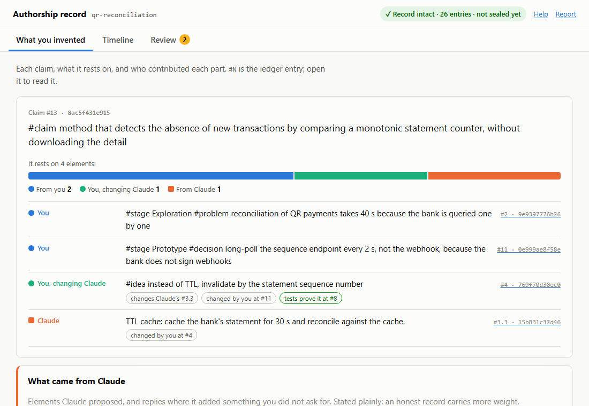
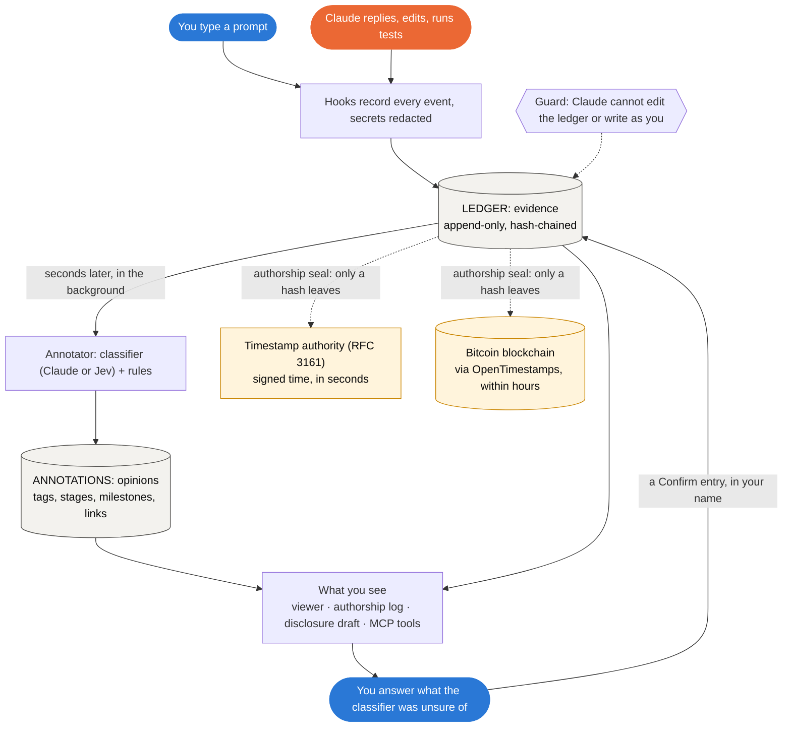
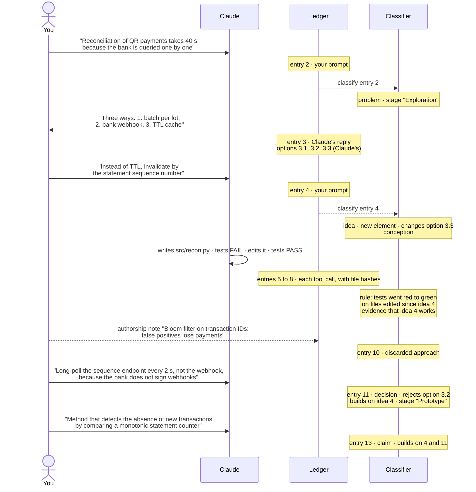
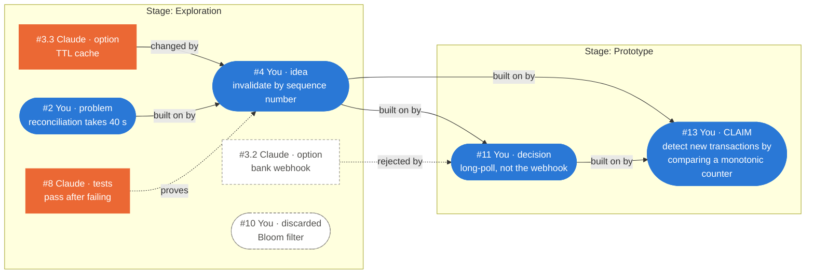
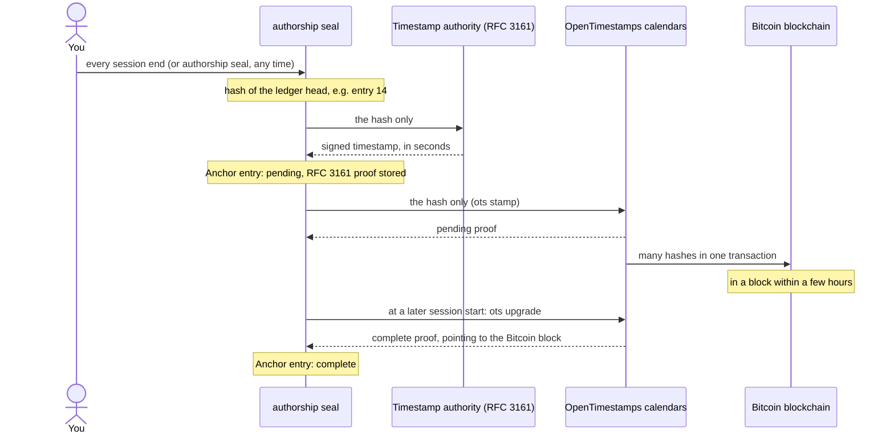

# authorship

**Proof of what you invented, and of what the AI suggested.**

When you design something with Claude, the moment you have the idea happens in a chat that nobody keeps. If you later file a patent, you may have to show that a person conceived the invention, not the AI. This Claude Code plugin keeps that record for you. You turn it on once; after that there is nothing to remember:

- **Everything is recorded.** Your prompts, Claude's replies, every file it edits and every test it runs go into a ledger inside your project.
- **Nobody can quietly change it.** Each entry is chained to the previous one by a hash, so editing any entry breaks the chain. Claude is blocked from touching the ledger or writing in your name. External timestamps can prove when the record existed.
- **Your ideas and Claude's ideas stay apart, on their own.** A classifier reads each entry in the background and works out what it is. That covers your problems, ideas, decisions and claims, the options Claude offered, and where you changed or rejected them. It also tracks when the work moved to a new stage. You never have to tag anything.
- **It ends in a draft for your attorney.** An invention disclosure where every element is quoted and cited to the exact ledger entry, AI-originated parts stated plainly.

To see what this looks like in practice, jump to [How a conversation becomes evidence](#how-a-conversation-becomes-evidence): diagrams and a worked example, message by message.

> Not legal advice, and no substitute for filing: patent priority comes from the filing date. Keep any repository that holds a ledger private. See [LEGAL-NOTES](authorship/docs/LEGAL-NOTES.md).

## Start in two steps

**1. Install the plugin** (inside Claude Code):

```text
/plugin marketplace add PedroVela/authorship
/plugin install authorship@authorship-dev
```

**2. Turn it on in your project** (inside Claude Code, in the project's folder):

```text
/authorship:init
```

That one command sets everything up:
- it starts recording, with no restart;
- it opens the viewer in your browser;
- it adds the protection rules;
- it installs your `authorship` command;
- it ends with a setup check like this one:

```text
Setup check:
  ✓ Python                                 3.9
  ✓ authorship command                     /Users/you/.local/bin/authorship
  ✓ Classifier                             Claude (claude-sonnet-5): text goes to Anthropic, ...
  ✓ RFC 3161 timestamps                    openssl
  ✗ Bitcoin timestamps (OpenTimestamps)    ots not installed
      doctor --fix installs opentimestamps-client in a private environment
  ✓ Record                                 1 entries, intact
  ✓ Protection rules                       in .claude/settings.json
  ✓ Background annotator and viewer        running
  • Sandbox                                off
      recommended: run /sandbox in Claude Code
```

If anything is marked `doctor --fix` (usually: `~/.local/bin` is not on your PATH yet, or the Bitcoin timestamp client is missing), run this once in a normal terminal, outside Claude Code:

```bash
~/.local/bin/authorship doctor --fix
```

It adds `~/.local/bin` to your shell profile, installs the OpenTimestamps client in a private environment, and starts anything that is not running. `authorship doctor` without `--fix` only checks, any time.

Requirements: Claude Code 2.1.281+ and Python 3.9+ (on a Mac, `python3` comes with the Command Line Tools). Runs on macOS, Linux and Windows. Nothing else to install by hand.

License: [MIT](LICENSE).

## How you use it

**While you work**, just work. Describe the problem, propose, decide, ask Claude to build and test, as you normally would. The classifier labels each entry within seconds; the tests Claude runs are recorded too. When a test passes after failing, that counts as evidence your idea works.

**In your terminal**, see what was recorded and how it was read:

```text
$ authorship log
#2     10-01 12:11  you     prompt   #problem~ reconciliation of QR payments takes 40 s because the bank is queried ...
#4     10-01 12:11  you     prompt   #idea~ instead of TTL, invalidate by the statement sequence number
#10    10-01 12:11  you     note     #discard~ Bloom filter on transaction IDs: false positives lose payments
#11    10-01 12:11  you     prompt   #decision~ long-poll the sequence endpoint every 2 s, not the webhook, ...
#13    10-01 12:11  you     prompt   #claim~ method that detects the absence of new transactions by comparing ...
(#tag~ = set automatically by the classifier)

$ authorship status
authorship ✓ 14 | 14 unsealed | 0 to review
classifier: on (claude-cli)
```

Add a note in your own name when something happened off the chat, for example an approach you tried and dropped: `authorship note "Bloom filter on transaction IDs: false positives lose payments"`.

**If you want to steer it**, type a tag: `#idea`, `#claim`, `#decision`, `#problem`, `#hypothesis`, `#discard`, `#stage <name>`. Spanish works too: `#problema`, `#hipotesis`, `#descarte`, `#etapa`. Your tag always wins over the classifier. Tags are optional.

**Every so often**, close the loop:

| Step | Command | What it does |
|---|---|---|
| Review | `authorship review` | Labels in your favor that the classifier was unsure of (0.50 to 0.80) wait here; accept, reject or edit each one. `--all` also lets you correct the ones already counted. |
| Seal | `authorship seal` | Gets an external timestamp for the current state of the ledger, so any later rewrite is detectable. |
| Draft | `/authorship:disclosure` (in Claude Code) | Writes `authorship-exports/<date>-disclosure.md` for your attorney, with every element cited to the ledger. |

### The viewer

`authorship open` shows the record in your browser, in four tabs:
- **Overview**: what you invented, and who contributed each element.
- **Timeline**: what happened, in order.
- **Map**: how the ideas connect, with a slider to replay how the record grew.
- **Review**: labels to check.



Guide: [docs/VIEWER.md](authorship/docs/VIEWER.md).

### Who classifies, and what it sees

By default the classifier is Claude itself, run in the background through the `claude` command with your existing login. No setup is needed, and the text goes to no one new: Claude Code already sends it to Anthropic. A 7-entry session takes about 16 s and US$0.03.

If you set a [Jev](https://docs.typesafe.ai/) key, Jev is used instead. The key can come from TypeSafe, the maker (`TYPESAFE_API_KEY`); from [OpenRouter](https://openrouter.ai/typesafe/jev-1.13) (`OPENROUTER_API_KEY`); or from the Vercel AI Gateway (`AI_GATEWAY_API_KEY`). It is faster and cheaper, and returns measured probabilities. But it sends the text of your invention to a new party, so set the key only if that is acceptable before filing.

You can also use any model on [OpenRouter](https://openrouter.ai/models) that answers in structured JSON, with the same prompt as Claude. That also sends the text to a new party.

To switch, in your own terminal:

```bash
authorship classifier use claude haiku                          # another Claude model
authorship classifier models openrouter gemini                  # list OpenRouter models, filtered
authorship classifier use openrouter google/gemini-3.8-flash    # needs OPENROUTER_API_KEY in your shell profile
authorship classifier use jev --provider openrouter             # Jev; needs a Jev key
authorship restart                                              # the annotator picks up the new settings
authorship classifier --test                                    # confirms which backend answers
```

`authorship classifier` shows what is in use at any time, and so does the viewer, in a strip on Overview and Review with a **How to change it** link.

The record leans against you, never for you:
- A label in your favor counts only from 0.80 confidence.
- A label against you (an idea that came from Claude) counts from 0.50.
- Labels are opinions: they never enter the ledger, and you can reject any of them.

Details: [docs/CLASSIFICATION.md](authorship/docs/CLASSIFICATION.md).

## How a conversation becomes evidence

### What happens to each message

Every message, edit and test run passes through the same path. You do nothing: the hooks write the record, and the annotator reads it in the background a few seconds later.



Two stores, kept apart on purpose:

- **The ledger is evidence.** It holds what was said and done, and your own answers. Each entry carries the hash of the one before, so changing any entry breaks the chain from that point.
- **Annotations are opinions.** They hold what the classifier and the rules think each entry is. They can be recomputed or rejected; they never touch the ledger.

To also prove the entries in your name are yours, sign them with your SSH key: `authorship sign setup`, once. Each prompt, note and confirmation then carries a signature that `authorship verify` checks.

Both live in `.authorship/` inside your project; nothing is uploaded. The ledger keeps your words verbatim, Claude's replies, the code it wrote and the commands it ran with their output. The session transcript is kept too, but without what tools returned: a file Claude read or a search result is stored as a hash, since the file is already in your project. The full list: [What is stored](authorship/README.md#what-is-stored).

### A worked example: the ping-pong of ideas

Here is a real session from the test suite, with no tags typed. The goal is to speed up the reconciliation of QR payments.



The same session, entry by entry: what was written, what the ledger records, and what each layer adds.

| # | Who | Message | Ledger records | Classifier adds | Rules add |
|---|---|---|---|---|---|
| 2 | You | "Reconciliation of QR payments takes 40 s because the bank is queried one by one" | your prompt, verbatim | **problem**; opens stage **Exploration** | |
| 3 | Claude | "Three ways to cut the reconciliation time: 1. batch per lot… 2. bank webhook… 3. TTL cache…" | Claude's reply | offers alternatives | three AI options: **#3.1**, **#3.2**, **#3.3** |
| 4 | You | "Instead of TTL, invalidate by the statement sequence number" | your prompt | **idea**, a new element (0.90); **changes Claude's #3.3**; builds on #2; **conception** | |
| 5 | Claude | writes `src/recon.py` | tool call, file hash after | | implements #4 |
| 6 | Claude | runs `pytest`: 1 failed | failed tool call | | tests fail against #4 |
| 7 | Claude | edits `src/recon.py` | tool call, file hash after | | implements #4 |
| 8 | Claude | runs `pytest`: 3 passed | tool call | | **evidence that idea #4 works** (red to green) |
| 9 | Claude | "Done: the cache is now invalidated when the sequence number changes" | Claude's reply | implements the instruction | |
| 10 | You (terminal) | `authorship note "Bloom filter on transaction IDs: false positives lose payments"` | your note | **discarded approach** | |
| 11 | You | "Long-poll the sequence endpoint every 2 s, not the webhook, because the bank does not sign webhooks" | your prompt | **decision**; **rejects #3.2**; builds on #4; opens stage **Prototype** | |
| 12 | Claude | writes `src/poller.py` | tool call | | implements #11 |
| 13 | You | "Method that detects the absence of new transactions by comparing a monotonic statement counter, without downloading the detail" | your prompt | **claim**; builds on #4 and #11 | |

Where the classifier comes in:

- **When:** after each entry reaches the ledger, in the background, usually within seconds.
- **On what:** your prompts and notes, and Claude's replies. Tool calls and test runs are left to the deterministic rules.
- **Labels in your favor** count automatically from 0.80 confidence; between 0.50 and 0.80 they wait for you in `authorship review`.
- **Labels against you** count from 0.50. A label against you means an element that came from Claude.
- **Your tags win.** If you type `#idea` or `#claim` yourself, that wins.

### How an idea matures

The labels and links build up a lineage: which element came from whom, and what each later one changed. This is the lineage of the claim at #13:



Blue rounded shapes are your entries; orange squares are Claude's; dashed shapes were discarded or rejected. The colors and shapes match the viewer. In maturity terms, the work moved through four steps:

1. A **goal** (#2: "too slow").
2. An **approach** borrowed from Claude (#3.3: cache it).
3. Your **mechanism** (#4: invalidate by sequence number), proven by tests (#8).
4. An **operative** decision and claim (#11, #13).

### Where the blockchain comes in

The hash chain makes any edit to an entry visible. It cannot, on its own, stop someone who controls the files from rewriting the whole chain with fresh, consistent hashes. External timestamps close that gap. `authorship seal` sends only the **hash of the latest entry** out of your machine, never your text, to two independent places:

1. **A timestamp authority (RFC 3161,** freetsa.org by default**).** It signs "this hash existed at this time" and answers in seconds.
2. **OpenTimestamps, which writes it into the Bitcoin blockchain.** Calendars aggregate many hashes into one Bitcoin transaction. Once that transaction is in a block, usually within a few hours, the proof points to that block. Nobody can backdate it, and anyone can check it with the free `ots` tool, without trusting this plugin.



What it proves: the whole record up to the sealed entry existed, exactly as it is, at that time. If anyone later rewrites any of those entries, even with a consistent new chain, `authorship verify --anchors` fails, because the recomputed head no longer matches the anchored one. The proofs are kept in `.authorship/anchors/`; commit them with the repository.

It runs on its own at the end of every session that added work, so there is nothing to remember. Only the hash leaves your machine; the timestamp authority also sees your IP address and when your sessions end.

```bash
authorship doctor --fix             # installs `ots`; without it, only the RFC 3161 timestamp is used
authorship seal                     # seal now, without waiting for the session to end
export AUTHORSHIP_ANCHOR=0          # turn off sealing at session end
```

The status line and the Overview show how far the record is sealed (`sealed to #N`). Entries after that are protected by the hash chain, but not yet by an external timestamp.

### What you see at the end

The annotator keeps watching while you work. The viewer refreshes every 4 seconds, and the status line updates. At any point, and at the end, you get the following.

**`authorship status`** shows the record is intact, how much of it is sealed, and how many labels wait for you:

```text
authorship ✓ 14 | 14 unsealed | 0 to review
classifier: on (claude-cli)
```

**The viewer's Overview** shows claim #13 with its four elements:

| Element | Origin | Evidence |
|---|---|---|
| #2: the problem | from you | |
| #11: the decision | from you | |
| #4: the idea | **you, changing Claude's #3.3** | tests prove it at #8 |
| #3.3: the TTL cache | **from Claude** | changed by you at #4 |

Under "What came from Claude", it lists #3.3 plainly.

**The disclosure draft** (`/authorship:disclosure`) turns the same lineage into an element table for your attorney. Every row is quoted from the ledger and cited by entry and hash:

```text
| Element                                                          | Origin | Citations                          |
|------------------------------------------------------------------|--------|------------------------------------|
| method that detects the absence of new transactions by ...       | human  | #13 (e9839eb6d842)                 |
| instead of TTL, invalidate by the statement sequence number      | mixed  | #4 (0f08ea152e7d), #3.3 (b49ea0e9333b) |
| long-poll the sequence endpoint every 2 s, not the webhook, ...  | human  | #11 (eb3409ae1600)                 |
| reconciliation of QR payments takes 40 s because ...             | human  | #2 (2dae2d765d6d)                  |
| TTL cache: cache the bank's statement for 30 s and reconcile ... | AI     | #3.3 (b49ea0e9333b)                |

## 5. Reduction-to-practice evidence
- #4 (0f08ea152e7d): tests pass at #8 (c950e60985b1) after failing, on files edited since the idea.
```

Hashes differ in each run; `tests/validate_citations.py` checks that every one resolves.

## If something goes wrong

| What you see | What to do |
|---|---|
| `refuses to run from Claude Code` | `note`, `review`, `seal` and `open` act in your name. Run them in a separate terminal, not through Claude and not with `!`. |
| The viewer did not open | `authorship open`. The page explains itself under "How to read this"; the full guide is [docs/VIEWER.md](authorship/docs/VIEWER.md). |
| Something does not work | `authorship doctor` checks every piece and prints the fix; `authorship doctor --fix` applies the ones it can. |
| Claude cannot look things up in the ledger | Restart Claude Code; the lookup server runs on the same `python3` as the hooks. `/mcp` inside Claude Code shows its state. |
| `authorship: no .authorship/ here` | You are outside a recorded project; `cd` into it, or run `/authorship:init`. |
| `authorship verify` says `BROKEN at #N` | Entry N was changed after it was written. Do not "fix" the ledger; tell your attorney. Git history shows when it changed. |
| Claude says `authorship guard: blocked` on normal work | The guard is too strict for that command: run it yourself, and report it as a bug. |
| The classifier is not running, or uses the wrong backend | `authorship classifier` says why and what this terminal would use. Usually the `claude` command is not on the PATH, `AUTHORSHIP_AUTO=0` is set, or a key was added after the annotator started: run `authorship restart`. Unclassified entries are picked up later. |
| The classifier read an entry wrong | Type the right tag next time, or run `authorship review --all` and reject or edit the label. |
| Anything else | Hook errors are logged in `.authorship/errors.log`; they never interrupt your session. |

To pause recording: `claude plugin disable authorship@authorship-dev` (the ledger stays; the pause shows up as a gap). To keep recording but stop the classifier: `authorship classifier use off`. To stop suggesting `/authorship:init` in other repositories: `export AUTHORSHIP_HINT=0`.

## More

- [Plugin reference](authorship/README.md): all commands, skills, settings and files
- [Automatic classification](authorship/docs/CLASSIFICATION.md): what is asked, which backend answers, thresholds, how to correct it
- [The viewer](authorship/docs/VIEWER.md): the four tabs, the symbols, and how answers are recorded
- [Threat model](authorship/docs/THREATS.md): what the plugin protects against, and what it does not
- [Build spec](AUTHORSHIP_PLUGIN_SPEC.md) and [deviations from it](authorship/docs/DEVIATIONS.md)

Development: `python3 -m venv .venv && .venv/bin/pip install pytest playwright`, then `.venv/bin/python -m pytest -q authorship/tests` and `claude plugin validate ./authorship`.
