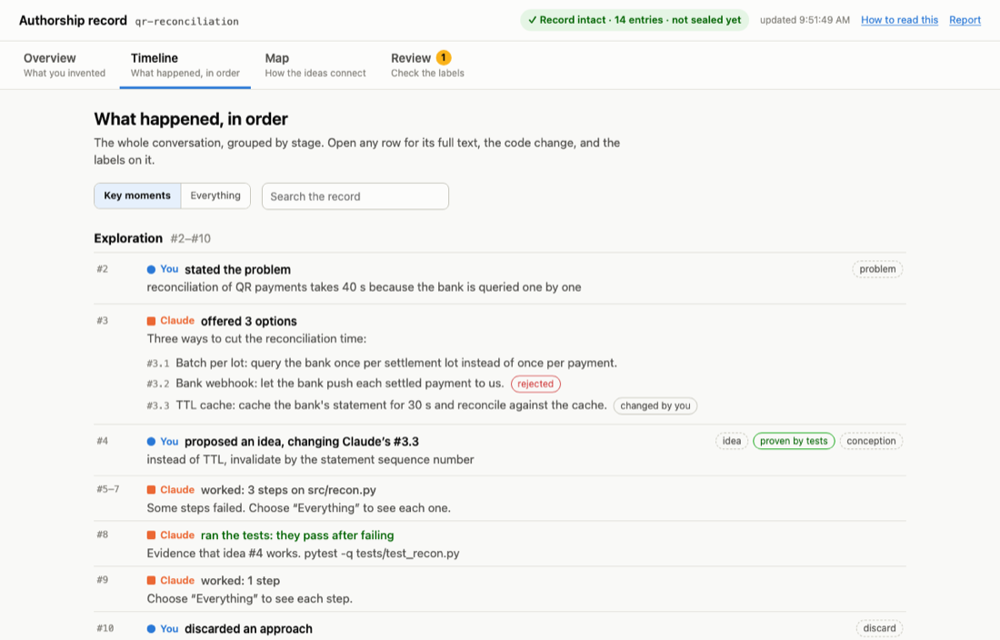
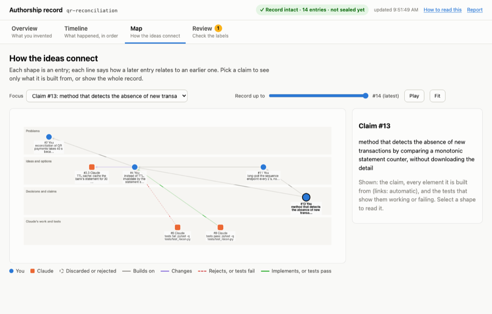
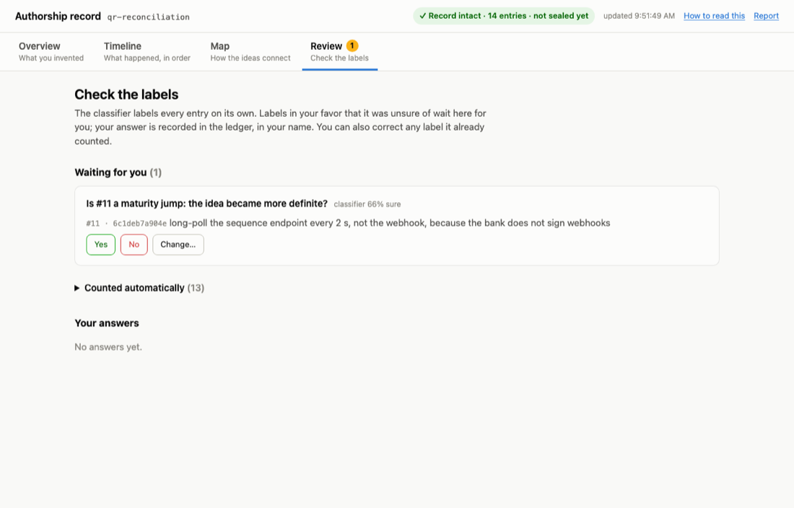

# The viewer

A local web page that shows the record in four views, in plain words. It runs on your machine only (`127.0.0.1`), starts in the background with each Claude Code session, and opens in your browser once.

To open it again: `authorship open` in your own terminal. A page opened any other way is read-only.

The four tabs answer four questions:

| Tab | Question |
|---|---|
| **Overview** | What did I invent, and who contributed each part? |
| **Timeline** | What happened, in order? |
| **Map** | How do the ideas connect? |
| **Review** | Which labels should I check? |

**How to read this**, in the page header, explains the tabs and symbols at any time.

## Symbols

The same everywhere. Identity is never shown by color alone: a shape and a word always go with it.

| Symbol | Meaning |
|---|---|
| Blue circle, "You" | Written by you |
| Orange square, "Claude" | Written by Claude |
| Green, "You, changing Claude" | Your element that changes something Claude proposed |
| Dashed outline, struck-through text | Discarded or rejected |
| Solid label (`idea`) | Typed by you, confirmed by you, or found by a deterministic rule |
| Dashed label (`idea`) | Set automatically by the classifier |
| Label with `?` | Waiting for your answer in Review |
| `#4`, `#3.2` | Ledger entry 4; option 2 of Claude's reply #3 |

The badge at the top says whether the record is intact. It turns red, with a banner, if any entry was changed after it was written.

## Overview

Four tiles first:

- **Record**: intact or broken, and where.
- **External timestamp**: how far the record is sealed (`authorship seal`).
- **Elements from you**: how many of the elements behind your claims came from you.
- **Waiting for you**: how many labels need an answer.

Then one card per claim:

- the claim, quoted from the ledger;
- a bar with how many of its elements came from you, from you changing Claude's proposal, and from Claude;
- the list of those elements, each with its origin, the entry it cites, and its evidence ("tests prove it at #8").

Below the claims, **What came from Claude** lists every AI-originated element plainly. An honest record weighs more.

The links between elements come from your confirmations and the automatic classifier, as in the disclosure draft.

## Timeline

The conversation in order, grouped by stage, one sentence per entry: "You proposed an idea, changing Claude's #3.3", "Claude offered 3 options", "Claude ran the tests: they pass after failing".

- **Key moments** (the default) shows what you wrote, the options Claude offered, test results that prove an idea, and the guard's blocks. Claude's routine work is folded into one row per stretch.
- **Everything** shows every entry, including each tool call.
- **Search** filters by any word, file name or `#seq`.

Open any row for:
- its full text;
- the code change, for edits;
- its labels, and how it links to other entries.

## Map

The same entries as a picture. Time runs left to right. There are four lanes:
- problems;
- ideas and options;
- decisions and claims;
- Claude's work and tests.

Lines say how a later entry relates to an earlier one:

| Line | Meaning |
|---|---|
| gray | builds on |
| purple | changes |
| dashed red | rejects, or tests fail against |
| green | implements, or tests pass |

- **Focus** a claim (the default when there is one) to see only what it rests on, plus the tests that show it working. Or show the key entries of the whole record, or everything.
- **Record up to** replays how the record grew; **Play** animates it.
- Hover a shape or a line for a summary. Select a shape to read it in the side panel and highlight its neighbors.

Records with more than 5,000 entries and links turn the Map off; the other tabs keep working.

## Review

The classifier labels every entry on its own. A label in your favor that it was not sure of (0.50 to 0.80) waits here as a question, for example "Is #11 a maturity jump: the idea became more definite?".

- **Yes**, **No** and **Change…** each record your answer in the ledger as a `Confirm` entry, in your name.
- **Counted automatically** lists every label and link already counted, so you can mark one **Not right** or change it.
- **Your answers** lists what you decided, most recent first.

The same can be done from the terminal with `authorship review` (and `authorship review --all`).

## Security

The page binds to `127.0.0.1` and rejects any other `Host` header. It writes nothing except Review answers.

Each answer needs the session secret. `authorship open` passes it in the address, and the page moves it out of the URL at once. Each answer also needs the page's own `Origin`.

Claude cannot read the secret or reach the port: the guard blocks both. Details in [THREATS.md](THREATS.md).

The page loads nothing from the internet. Its only library, cytoscape, is served locally from `viewer/vendor/`.
